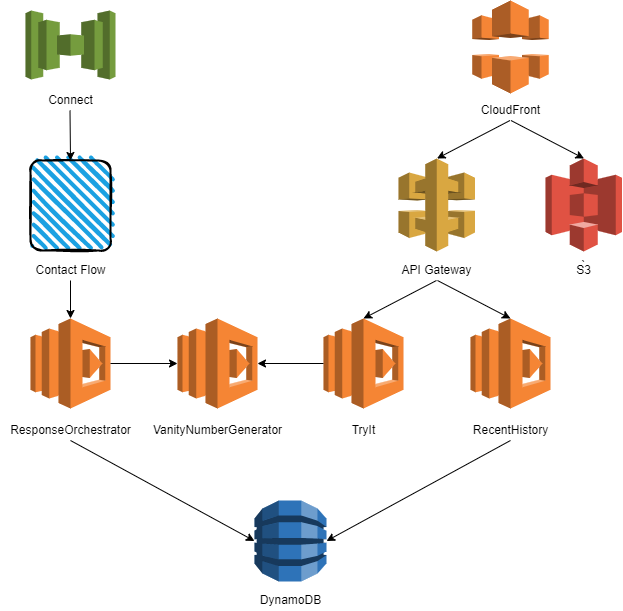

# Overview

## Description

This is a demonstration project to show how to generate dynamic speech with an Amazon Connect contact flow.

The premise for the project is a service that you can phone that will tell you the three best vanity phone-numbers for the number you called from.

There is also a [web client](documentation/WebClient.md) that serves as a monitoring dashboard to let you see the five most recent calls and to try out the vanity phone-number generator without the need to phone the service.

## Approach

As a learning exercise I elected to use the [AWS CDK](https://aws.amazon.com/cdk/) to create a deployment package. This was my first time using the AWS CDK but I found it intuitive having previously used Cloud Formation and SAM templates for creating deployments.

Custom resources were developed to create and manage the Amazon Connect contact flow and to manage associating lambda functions with the Amazon Connect instance.

### Architecture

* [Amazon Connect](documentation/AmazonConnect.md)
    * [Contact Flow](documentation/ContactFlow.md)
        * [ResponseOrchestration Lambda](documentation/ResponseOrchestration.md)
            * [DynamoDB](documentation/DynamoDB.md)
            * [VanityPhoneNumberGenerator Lambda](documentation/VanityPhoneNumberGenerator.md)
* [Cloud Front](documentation/CloudFront.md)
    * [S3](documentation/S3.md)
    * [API Gateway](documentation/ApiGateway.md)
        * [RecentHistory Lambda](documentation/RecentHistory.md)
            * [DynamoDB](documentation/DynamoDB.md)
        * [TryIt Lambda](documentation/TryIt.md)
            * [VanityPhoneNumberGenerator Lambda](documentation/VanityPhoneNumberGenerator.md)



## Deployment

To deploy this project to your own Amazon Connect instance insert your instance's ARN into the following command.

```
npm install
cdk deploy \
    --parameters "AwsConnectInstanceArn=arn:aws:connect:us-east-1:551352683362:instance/20d853e7-3960-4a5a-80c9-f198ee84cb1a" \
    --parameters ContactFlowName="Vanity Phone-number Generator"
```

All dependencies are built as part of the deployment, this includes running `npm install` for the lambda packages and `npm run build` for the React web application.

The newly created contact flow must be manually linked to the required phone-number in the Amazon Connect console.

## Testing

### Unit testing

All unit tests can be run using the following command from the root directory.

```
npm test
```

### Testing locally

The CDK build will otput the correct content for the locals.json file to allow you to invoke the lambda functions locally using SAM. Copy this text from the deployment output and save it to a locals.json file in the project root folder.

For testing instructions for each module see.

* [API Gateway](documentation/ApiGateway.md)
* [TryIt](documentation/TryIt.md)
* [RecentHistory](documentation/RecentHistory.md)
* [ResponseOrchestration](documentation/ResponseOrchestration.md)
* [VanityPhoneNumberGenerator](documentation/VanityPhoneNumberGenerator.md)

## Issues/Questions

The following are unresolved questions at this time.

* why did custom resource PhysicalId always end up being set to RequestId when calling ResponseUrl?
    * in my initial attempt at creating the custom resource I was calling the response URL myself, for some reason the resource always ended up having the PhysicalId set to the RequestId despite me explicitly setting it otherwise.
* better understand SAM testing within the CDK environment.
    * better VS Code integration, debugging etc.
    * why does `sam local start-api` not pick up environment variables from locals.json?
* how to unit test infrastructure code in the CDK stack?
    * a basic test is included but I need to better understand the expected approach.
    * all lambda functions and the React application are rebuilt as part of the test which seems unnecessary.
* figure out how to correctly combine CDK, lambda and React tests into one suite.
    * I am currently achieving this using the scripts tag in the package.json file but it seems there should be a better approach.
* understand why Cloud Front was unable to access S3 when the Origin Access Identity was enabled.

## Enhancements/TODOs

The following lists incomplete work and future enhancements for this project.

* improved sequence list.
    * add recognizable sequences that are not English words e.g. AAA, ABC, XYZ.
    * prioritize the order of words in the sequence list to recommend more commonly used words first.
    * remove obscenities.
    * add proper nouns.
    * add in short phrases e.g. BIGDOG.
* store indexed word list in DynamoDB to improve cold startup time on the VanityPhoneNumberGenerator lambda.
* enable caching on the Cloud Front distribution to reduce calls to the S3 bucket and API Gateway endpoint.
* add a fixed domain.
* add support for multiple languages, including language specific sequence lists.
* more unit tests, including completing the following.
    * vanity_phonenumbers_api/VanityPhoneNumberGenerator.js and response_orchestrator/VanityPhoneNumberGenerator.js.
    * response_orchestrator/DatabaseWriter.js.
    * calls_api/DatabaseReader.js.
* logging.
    * use an injected logging module for consistency in favor of console.log throughout code.
    * export logs to third party analysis tooling e.g. Sumo, Datadog.
* add authentication/authorization to web application and API endpoints.
    * AWS Cognito with a SAML federation, so that contact center workers can use same credentials as for the Amazon Connect console.
* lock down S3 bucket to only enable access via Cloud Front (tried unsuccessfully, see above).
* lock down API Gateway endpoint to only enable access via Cloud Front.
* change calls_api from polling to web socket.
