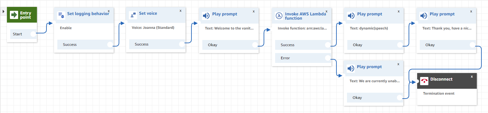

# Contact Flow

## Overview

The deployment package will create a new contact flow in the [Amazon Connect](AmazonConnect.md) instance. The name of the new contact flow can be specified in the deployment parameters to avoid possible clashes with existing flows.

First a welcome message is played.

The contact flow then invokes the [ResponseOrchestration](ResponseOrchestration.md) lambda function to retrieve dynamic text, speaking the generated vanity phone-numbers for the callers phone-number.

Finally, a thank-you message is played before termination.

If an error occurs during the lambda call an error message is played.

