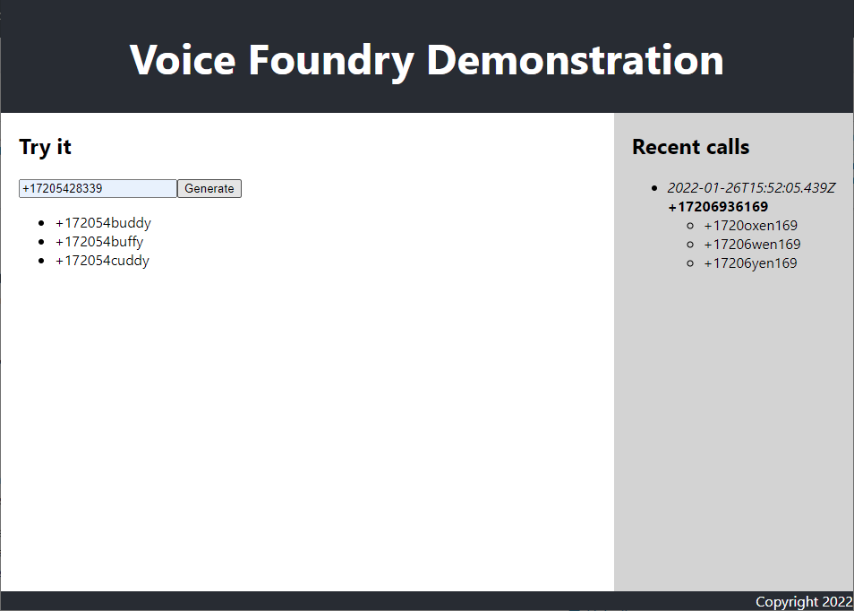

# Web Client

## Overview

The web client application allows for testing the vanity phone-number generator without the need to call the Amazon Connect contact center phone-number. It also displays the five most recent calls received.

The application is developed using the React framework and is hosted in an [S3 bucket](S3.md).

There are two APIs that support the web client application.

```
GET /api/phonenumbers/{phoneNumber}/vanityphonenumbers
```

```
GET /api/calls
```



## Development and testing

To develop and test the web client locally first add the Cloud Front distribution URL to the ./www/.env.local file e.g.

```
REACT_APP_API_HOST=https://d6xd32ccz9mbw.cloudfront.net
```

Then run

```
cd www
npm start
```